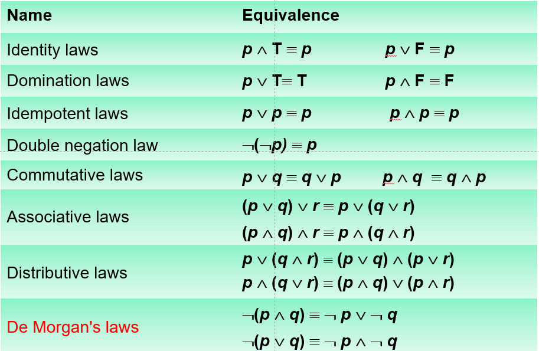
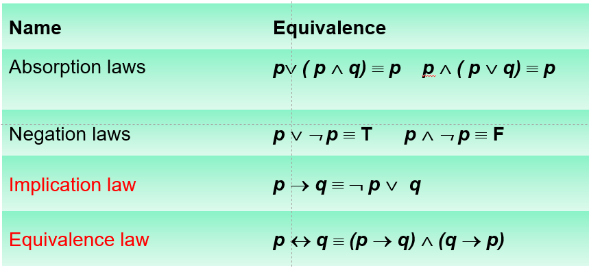

# **第一章:逻辑和证明**
## **1.1 命题逻辑**
- *命题(proposition)*
    - 称述性语言, 要么为真, 要么为假
- *命题变量(proposition variable)*
    - 用小写字母表示$p, q, r, s....$
- *真值(truth value)*
    - $T/F$
- *六种逻辑操作(logical operators)*
    - $\neg$ 否定(negation)
    - $\land$ 合取/且(conjunction)
    - $\lor$ 析取/或(disjunction)
    - $\oplus$ 异或(exclusive or)
    - $\rightarrow$ 蕴含(conditional)
    - $\leftrightarrow$ 双重蕴含(biconditional)
- *条件语句的等价形式*(记住这三个特殊的)
    - If $p$, then $q$
    - $p$ only if $q$
    - $q$ unless $\neg p$
- *逻辑操作的优先级*
    - 括号的优先级最高
    - $\neg$ > $\land$ > $\lor$ > $\oplus$ > $\rightarrow$ > $\leftrightarrow$
- *位运算操作*
- bitwise AND: $p \land q$
- bitwise OR: $p \lor q$
- bitwise XOR: $p \oplus q$

## **1.2 命题逻辑的应用**
- *一致的(consistent)系统规范*
    - 系统规范: 由一组命题组成的集合, 称为系统
    - 系统的一致性: 存在一组真值变量的赋值, 使得系统中每个命题都为真或为假

## 1.3 **命题等价**
- *复合命题的分类
    - 永真命题(tautology)
    - 矛盾命题(contradiction)
    - 或然命题(contigency)
- *等价命题的定义*
    - $p \leftrightarrow q$
- *常见的等价命题*

!!! note "如何证明两个命题逻辑等价"
    - 1 真值表相同(当命题变量较多时, 显然不够效率)
    - 2 使用等价公式
    - 如何证明不等价: 找出反例(对变量进行赋值即可)(最快且有效率)
- $p\downarrow q$ 表示NOR运算, 只有p和q均为假时整个式子才为真
    - $p\downarrow p和 \neg p$ 等价
    - $(p\downarrow q)\downarrow(p\downarrow q) 和p\lor q$ 等价
- 命题的可满足性(satisfiability)