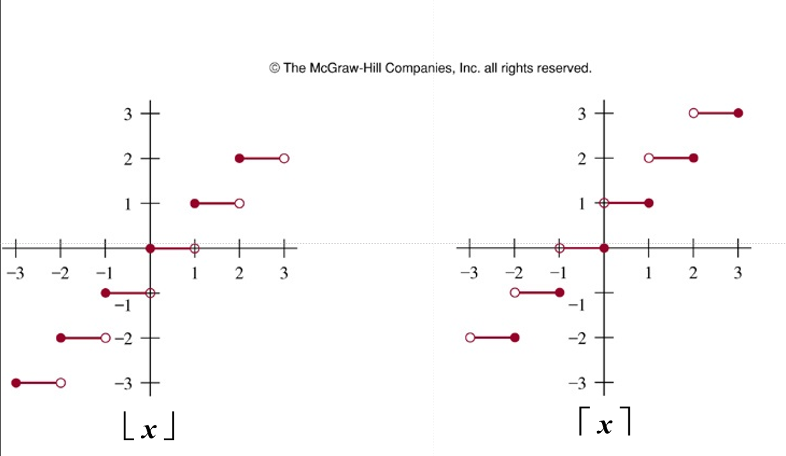

# **第二章:基础结构** 
## **2.1 集合 Sets**
1. 定义
    - 无序对象集
    - 对象可称为元素(elements)或成员(members)
    - 一般用大写字母表示集合,用小写字母表示元素
    - $a\in A$ $a$是集合$A$中的一个元素 ($a\not \in A$)
2. 子集
    - $A \subseteq B\iff \forall x(x\in A \to x\in B) $
    - $A = B \iff A \subseteq B\land B \subseteq A$
    - 真子集 $\subset$

3. 幂集
    - $P(S) = \{x|x\subseteq S\}$ (此处$x$代表集合)
    - $|S|= n$ 代表$|P(S)| = 2^n$

??? question "$P(A)\in P(B) \implies A\in B $"
    - $P(A)\in P(B) \implies P(A)\subseteq B$
    - $(A\in P(A))\land (P(A)\subseteq B) \implies A\in B$

4. 笛卡尔积 
    - $A\times B = \{(a,b)|a\in A\land b\in B\}$
    - 没有交换律
    - $n$个集合相乘,笛卡尔积就是$n$维的
    - 任何集合与空集的笛卡尔积均为空集

## **2.2 集合操作**
- 并集 $A\cup B$(Union)
- 并集 $A\cap B$(Intersection)
- $|A\cup B| = |A| + |B| - |A\cap B|$
- 集合的差 $A-B = {x|x\in A\land x\not \in B}$
- 补集 $\overline{A} = \{x|x\not \in A\land x\in U\}$
- 对称差 只属于集合中的一个

??? question "如何证明两个集合相等?"
    - $C=D \iff C\subseteq D \land D\subseteq C$
    - 使用集合描述式表达法
    
$$
\begin{align}
\overline{(A\cup B)} = \{x|x\not \in A\cup B\} \\
=\{x|\neg (x\in A\cup B)\} \\

\end{align}
$$

=\{x|\neg (x\in A\lor x\in B)\} \\
=\{x|\neg (x\in A)\land \neg (x\in B)\} \\
=\{x|\not \in}

## **2.3 函数 Functions**
1. 定义
    - $f:A \mapsto B$ (function/mapping/transformations)
        - $ \forall a(a\in A\rightarrow \exists! b(b\in B \land f(a)=b)) $
        - $A$ 定义域($domain$)
        - $B$ 值域($codomain$)
    - $f(a)= b$
        - b称作a在$f$作用下的像($image$)
        - a称作b的原像($preimage$)
2. 性质
    - $(f_1 + f_2)(x) = f_1(x)+f_2(x)$
    - $(f_1f_2)(x) = f_1(x)f_2(x)$
    - $f(S) = \{ f(s)| s\in S\}$
3. 函数的图像
    - 将$\{(a,b)|a\in A \land f(a) = b \}$绘制在一个坐标系中
4. 单射与满射 
- 单射 ($one-to-one/injective$)
    - $\forall a\forall b(f(a) = f(b) \to a=b) $
- 满射 ($onto/surjective$)
    - $\forall b \in B\exist a\in A(f(a) = b) $
- 一一映射 ($bijection$) 既是满射又是单射
5. 函数类型 
    - 单调递增/递减函数
    - 反函数(只有一一映射才有反函数)
    - 复合函数
    - 高斯函数 
        - 向下取整($floor function$) $\lfloor x\rfloor $
        - 向上取整($ceiling function$) $\lceil x\rceil $

## **2.4 序列 Sequence**
### 1. 引言 Introduction
- 实际上是对有序数组的一种映射(数组往往是$\{0, 1, 2,...\}$或$\{1,2,3,...\}$)
- 用$a_n$表示$n$的像
- 等差数列和等比数列
- 求和符号$\sum_{i=m}^{n} a_i$
- 常见的求和公式:

## **2.5 集合的基数 Cardinality of Sets**
1. 基数的定义
    - **定义 1**: $A$的基数和$B$相等, 表示为$|A|=|B|$当且仅当$A$和$B$之间存在一一对应关系. 
    - **定义 2**: 如果从$A$到$B$存在一个映射, $A$的基数比$B$小, 写作$|A| \leq |B|$.
        - 此时如果他们基数不同,则我们说$|A| < |B|$. 
    - **Schrőder-Bernstein Theorem**: 如果 $|A| 和 |B|$ 满足  $|A| \leq |B|$ 并且 $|B| \leq |A|$, 那么 $|A| = |B|$.
2. 集合的有限与无限
    - 有限的
        - $\{1,2,3\}$
    - 无限, 但是和正整数集有相同的基数(countable infinity set)
        - $ \aleph_0 $ : 阿列夫零(描述可数无穷的集合如 $\mathbb{N}$ )
        - 如果 $|A| = |\mathbb{N}| = \aleph_0 $, 则 $A$ 为可数无穷集合. 
            - 建立由$|A| 到 |\mathbb{N}|$的一一映射
    - 一个集合是可数的当且仅当它的元素可以被一个正整数序列编号
    - 证明:$|A| = |\mathbb{N}|,\ \forall a\in A\{a = x\times y|x,y \in \mathbb{N}\}$

3. 性质:
    1. 没有无限集的基数小于可数集。
    2. 两个可数集的并集是可数的。
    3. 有限数量的可数集的并集是可数的。
    4. 可数个可数集的并集是可数的。

??? question "1. 0至1之间的有理数是不可数的"
    - 记0~1之间的实数集为 $A$ ( $A = \{ x \in (0,1) | x \in \mathbb{R} \}$ )
    - 证明
        1. 对0~1的所有小数进行编号 
            - $d_{ij}$ 代表第i个数的第j位小数 
            - $r_i = 0.d_{i1}d_{i2}d_{i3}...$ 
        2. 只需构造 $x = 0.x_1x_2x_3...$
            - 其中 $x_i \neq d_{ii}$
        3. 此时我们可以找到一个未被我们编号的小数,根据引言中的**D2**, 可知 $|\mathbb{N}| < |A|$

??? question "2. 幂集基数大于其原集"
    - $|A|<|P(A)|$
    - 证明
        1. 假设相等, 则可以找到一个一一映射, $x_i \mapsto f(x_i)(原集的子集) $
        2. 我们构造一个集合, 包含所有满足不在自己映射的集合中的性质的元素
        3. 然而对于这个构造出的集合, 也会有一个元素的映射结果是它(满射的性质), 考虑该元素是否存在于这个集合中
            - 存在, 则其应当满足这个集合中元素的性质, 即不在自己映射的集合中
            - 不存在, 则其满足该集合的"入集条件", 应当存在
        4. 矛盾, 故假设不成立, 则幂集和原集基数不同, 同时我们找到原集到幂集的一种映射($x_i \mapsto \{x_i\}$), 故得$|A|<|P(A)| $

??? question "3. 在实数域下有|[0,1]| = |(0,1)|"
    1. $|(0,1)| \leq |[0,1]|$
        - $\because (0,1) \subseteq [0,1] \therefore |(0,1)| \leq |[0,1]|$ 
    2. $|(0,1)| \geq |[0,1]|$
        - 构造一个映射$g :x \mapsto \frac{1}{2}x+\frac{1}{4} $
        - 得$|[0,1]| = |[\frac{1}{4}, \frac{3}{4}]| \leq |(0,1)|$

